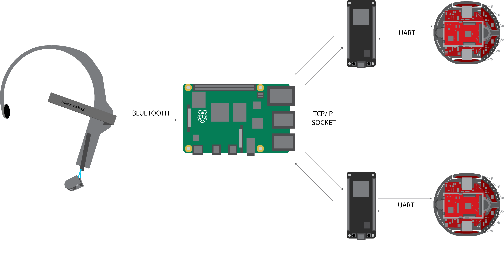

# Towards Brain Swarm Interfaces
This is a project working towards fully functional Brain Swarm Interfaces (BSI). It is meant as proof of concept for future development enabling multiple robots to be controlled using brain signals.

[ROBOT documentation](ROBOT/readme.md)

## Hardware
The hardware required for the project are:

|                             | Hardware components                                           | Amount |
|-----------------------------|---------------------------------------------------------------|--------|
| Robot                       | TI Robotics System Learning Kit MAX (TI-RSLK MAX)             | 1      |
|                             | Ultrasonic Sensor (HC-SR04) OR Infrared Sensor (GP2Y0A21YK0F) | 3      |
|                             | ESP32 Devkit V1                                               | 1      |
|                             | Jump wire                                                     | 16     |
| Brain-Computer Interface    | Neurosky Mindwave Mobile V1                                   | 1      |
| Central Communication Point | Raspberry PI 4B                                               | 1      |


## Software
The following software programs and languages were used to programm the hardware:

|                                                   | Software programs                                                          | Software languages |
|---------------------------------------------------|----------------------------------------------------------------------------|--------------------|
| TI Robotics System Learning Kit MAX (TI-RSLK MAX) | [Texas Instruments Code Composer Studio](https://www.ti.com/tool/CCSTUDIO) | C                  |
| ESP32 Devkit V1                                   | [Arduino IDE](https://www.arduino.cc/en/software)                          | C++                |
| Raspberry PI 4B                                   | VS Code with Remote SSH extension                                          | Python             |

## Installation

### Programming the Raspberry Pi:
Download and install Python3, Pip3 and all packages for bluetooth on the Raspberry Pi using ```sudo apt-get install python3 python3-pip bluetooth bluez blueman```.

Download and install pybluez using ```sudo pip3 install pybluez```.

Copy the files located under [RPI](RPI) to a folder on the Raspberry Pi.

You can now run the server using ```sudo python3 MindwaveMobile.py```.


### Programming the ESP32:
Download and install [Arduino IDE](https://www.arduino.cc/en/software).

Add ```https://raw.githubusercontent.com/espressif/arduino-esp32/gh-pages/package_esp32_index.json``` to the Additional Boards Manager URLs under the settings of the Arduino IDE.

Select the correct board under ```Tools->Board->ESP32 Arduino``` and the correct Port under ```Tools->Port```.

Change the network ssid and password as well as the servername to the corresponding values for a local wifi network (Hosting an access point on the Raspberry Pi makes the setup easily portable).

Compile and flash [ESP32/ESP32.ino](ESP32/ESP32.ino) to the ESP32.

### Programming the TI RSLK MAX:
Download and install [Code Composer Studio](https://www.ti.com/tool/CCSTUDIO).

Connect the TI RSLK MAX to the pc.

Change line 32 of [ROBOT/RobotModel/include/differentialRobot.h](ROBOT/RobotModel/include/differentialRobot.h) to ```#define ULTRASOUND 1``` when using ultrasound or ```#define ULTRASOUND 0``` when using infrared.

Compile and flash [ROBOT/main.c](ROBOT/main.c) to the TI RSLK MAX.


### Connecting everything:
Connect the Mindwave Mobile to the Raspberry Pi using bluetoothctl as described in: [How to setup Bluetooth on a Raspberry Pi 3](https://www.cnet.com/tech/computing/how-to-setup-bluetooth-on-a-raspberry-pi-3/)

Connect the ESP32 to the TI RSLK MAX as follows:
| ESP32 | TI RSLK MAX |
|-------|-------------|
|   Vin |          5V |
|   GND |         GND |
|   RX0 |        P3.3 |
|   TX0 |        P3.2 |

The entire setup should look something like this, where the number of ESP32s and TI RSLK MAXs may differ:



## Starting everything:
Start the python server using ```sudo python3 MindwaveMobile.py``` on the Raspberry Pi.

Turn on the TI RSLK MAX and wait till the Raspberry Pi terminal shows the incomming connection.

Press the two buttons on either side of the TI RSLK MAX simultaneously and release.

The Raspberry Pi terminal should now show START INFRARED or START ULTRASOUND depending on what sensors were used.

The setup is now working, to start driving try and focus on something. To turn left blink two times. To turn right blinks three times.


## Troubleshooting:
Make sure the ESP32's and Raspberry Pi are connected to the same network.

Make sure you did not flip the RX and TX pins.

Make sure Vin is connected to 5V (not 3V3 which would cause the brownout detector to trigger).

## Extras:
The folder [EXPERIMENTS](EXPERIMENTS) contains files for the experiments conducted in the paper: [Towards Brain Swarm Interfaces](towards_brain_swarm_interfaces.pdf)


## Contact:
- Aaron van Diepen
- Kilian van Berlo - S2613352 - k.vanberlo@student.utwente.nl

Project Link: https://github.com/KilianBerlo/Towards-Brain-Swarm-Interfaces
