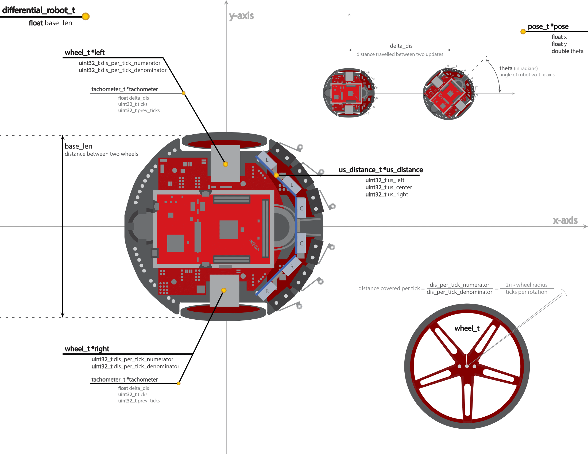
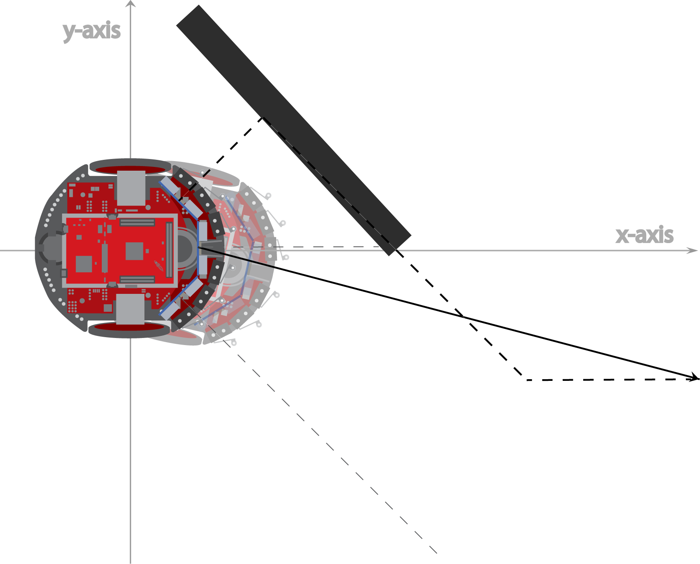
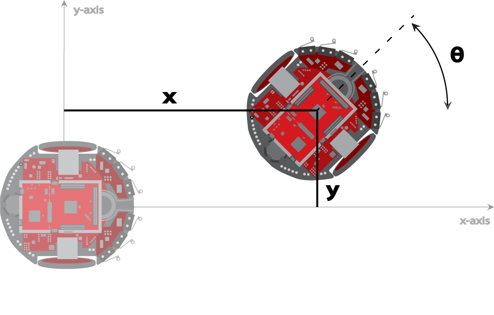

# ROBOT documentation
This is the part of O_Robot that implements the controlls for the [TI RSLK MAX](https://www.ti.com/tool/TIRSLK-EVM).

## Measurements & Parameters
The TI RSLK MAX is a differential drive robot, this means its movement is based on two separately driven wheels placed on either side of the robot body, thus it has no steering motor.

The software for the robot uses several pre-specified parameters already defined in [differentialRobot.h](RobotModel\include\differentialRobot.h), they are:
| Name                   | Description                                                              |
|------------------------|--------------------------------------------------------------------------|
|   RADIUS               |                                                the wheel radius in meter |
|   TICKS_PER_REV        |                                               ticks per wheel revolution |
|   BASE_LENGTH          |                                 distance between the two wheels in meter |
|   TICK_DIS_NUMERATOR   |                                                                        * |
|   TICK_DIS_DENOMINATOR |                                                                        * | 
|   ULTRASOUND           |       1 if the robot has ultrasound sensors 0 if it has infrared sensors |

* we define the distance per tick as a numerator and denominator in order to avoid float operations consequently we must multiply and then divide to arive at the correct integer value
TICK_DIS_NUMERATOR / TICK_DIS_DENOMINATOR =  2 * PI * RADIUS / TICKS_PER_REV

## Pins

All relevant pins for the TI RSLK MAX are:

| TI-RSLK MAX |        |               |                 |
|-------------|--------|---------------|-----------------|
| Component   |        | Pin component | Pin TI-RSLK MAX |
| ESP32       |        | TXD           | P3.2            |
|             |        | RXD           | P3.3            |
|             |        | VIN           | 5V              |
|             |        | GND           | GND             |
| Ultrasound  | Left   | ECHO          | P2.5            |
|             |        | TRIG          | P6.0            |
|             |        | VCC           | 5V              |
|             |        | GND           | GND             |
|             | Center | ECHO          | P6.5            |
|             |        | TRIG          | P6.4            |
|             |        | VCC           | 5V              |
|             |        | GND           | GND             |
|             | Right  | ECHO          | P3.0            |
|             |        | TRIG          | P4.1            |
|             |        | VCC           | 5V              |
|             |        | GND           | GND             |
| Infrared    | Left   | V0            | P9.0            |
|             |        | VCC           | 5V              |
|             |        | GND           | GND             |
|             | Center | V0            | P6.1            |
|             |        | VCC           | 5V              |
|             |        | GND           | GND             |
|             | Right  | V0            | P9.1            |
|             |        | VCC           | 5V              |
|             |        | GND           | GND             |
| DC motor    | Left   | Spinning DIR  | P5.4            |
|             |        | PWM           | P2.7            |
|             |        | Sleep mode    | P3.7            |
|             | Right  | Spinning DIR  | P5.5            |
|             |        | PWM           | P2.6            |
|             |        | Sleep mode    | P3.6            |
| Tachometer  | Left   | ELA           | P10.5           |
|             | Right  | ERA           | P10.4           |
| Clock       |        | Debugging     | P1.0            |

## Obstacle avoidance (direction vector calculation)

The following image displays how the vector for obstacle avoidance is calculated using the measurements of the ultrasound/infrared sensors.

As seen for each sensor a vector is calculated relative to their position on the robot, these are then summed in order to receive a vector that points into a direction avoiding the obstacle.

## Tachometer (position and angle update)

After a tachometer interupt is triggered for either wheel a counter is increased for that wheel. After a certain time a timer is triggered which uses the counters for the tachometer to update the position and angle of the robot based on how much each wheel has turned.

